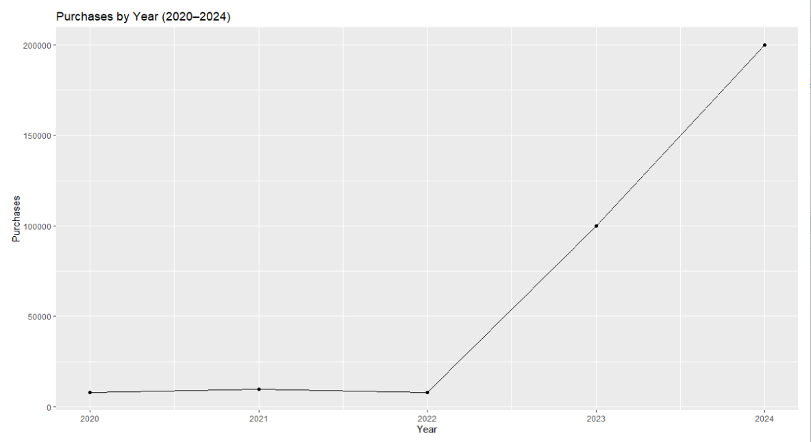
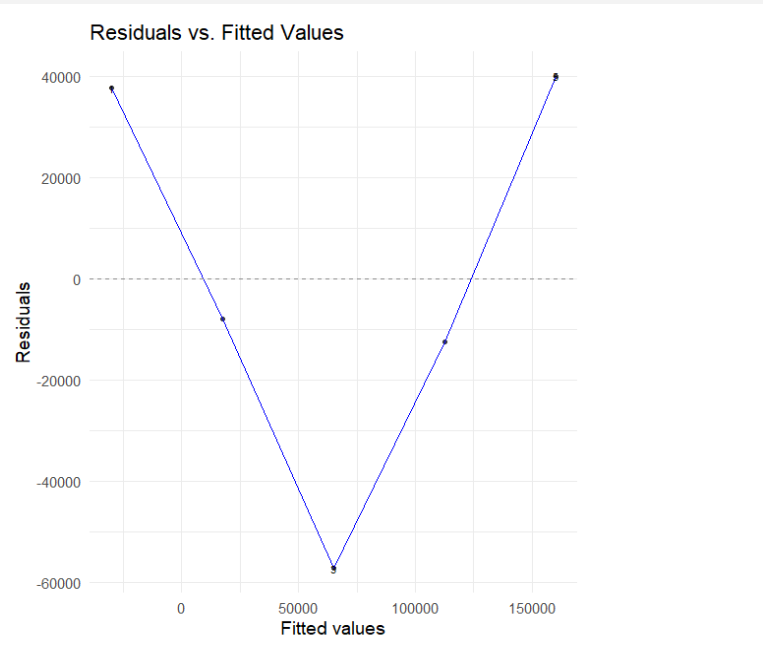
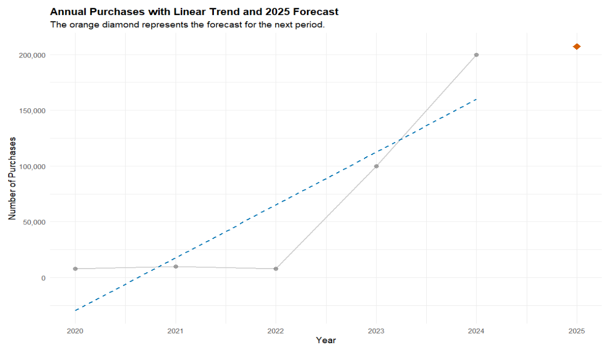

# 📈 Forecasting Yearly Trends with Linear Regression in R

## 🔍 Project Overview

This project demonstrates how to model and forecast **year-over-year trends** using simple linear regression on time series data. The example is based on a fictional dataset tracking purchases over a five-year period (2020–2024), but the approach is broadly applicable to many industries.

### Applicable Use Cases
- 📚 **Education** – Forecasting student applications  
- 🛍️ **Retail** – Predicting annual sales or purchases  
- 💼 **HR** – Projecting yearly hires or attrition  
- 🏥 **Healthcare** – Estimating patient visits or claims  
- 📈 **Finance** – Anticipating new account openings or investments  
- 🏭 **Manufacturing** – Planning production demand  
- 🌐 **Tech & SaaS** – Tracking user sign-ups or subscriptions  

---

## 📊 Dataset

**File:** `yearly_activity_data.csv`  

**Structure:**
- `Year`: Integer (e.g., 2020, 2021, …)  
- `Purchases`: Numeric value representing quantity of interest  

> 📝 *Note: This dataset is fictional and created for demonstration purposes only.*

---

## 📦 R Packages Used

```r
library(ggplot2)
library(dplyr)
library(ggfortify) # for model diagnostic plots
library(scales)    # for axis formatting

```
## 🔨 Workflow Summary
``` 
# --- 1. Setup ---
# Load dataset
XYZdf <- read.csv("yearly_activity_data.csv")

# --- 2. Initial Time Series Plot ---
ggplot(data = XYZdf, aes(x = Year, y = Purchases)) +
  geom_line(color = "#0072B2") +
  geom_point(size = 3, color = "#0072B2") +
  labs(title = "Purchases by Year (2020–2024)",
       x = "Year",
       y = "Purchases")

# --- 3. Fit Linear Regression Model ---
# Add a numeric time variable
XYZdf$Time <- 1:nrow(XYZdf)

# Fit model
model <- lm(Purchases ~ Time, data = XYZdf)
summary(model)

# --- 4. Model Diagnostics ---
# Residuals vs. Fitted
autoplot(model, which = 1)

# Q-Q Plot
autoplot(model, which = 2)

# --- 5. Forecast 2025 ---
new_time <- data.frame(Time = 6)
predict(model, newdata = new_time)
```
---
## 📊 Generated Plots

Below are the figures generated by the analysis script:

## 📈 Plot 1: Purchases by Year (2020–2024)


## 📉 Plot 2: Residuals vs. Fitted Values


## 📐 Plot 3: Normal Q–Q Plot of Residuals


## 🔮 Plot 4: Forecasted Purchases for 2025

----
## 💡 Insights & Takeaways

- Linear regression provides a transparent, interpretable model for identifying trends.

- Useful in early-stage forecasting or when a quick baseline prediction is needed.

- Can support budgeting, planning, and strategy across industries.

- Diagnostic plots validate whether assumptions hold (linearity, residual distribution).

- Forecasts provide a point estimate that can be extended with intervals in future work.
---
## 📁 Files Included

- `yearly_activity_data.csv` – Synthetic dataset

- `analysis.R`– Full analysis script

- `1_initial_purchases_plot.png` – Initial purchases plot

- `2_residuals_vs_fitted.png` – Residuals vs. fitted diagnostic

- `3_normal_qq_plot.png` – Normal Q–Q plot

- `4_forecast_plot.png` – Forecasted purchases for 2025

- `README.md` – Project documentation
